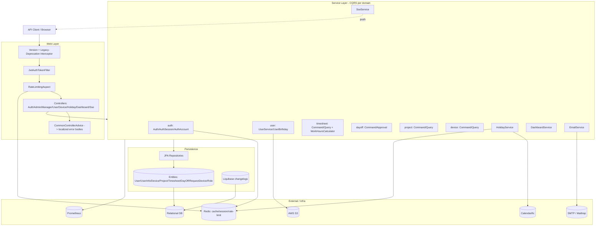
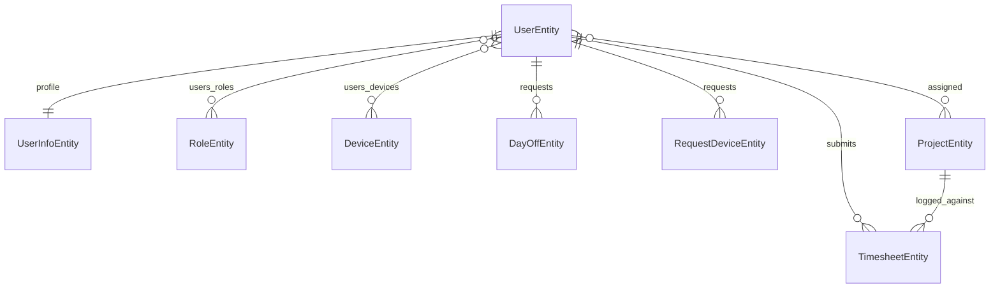

# Design Document

## Overview

This document describes the **as-implemented** architecture of the HRM Tool
(Next Gen) backend and the test architecture used to validate it against
[`requirements.md`](./requirements.md). The application is a layered Spring Boot
3 / Java service exposing a dual-versioned REST API, backed by a relational
database (JPA + Liquibase), Redis (cache / session / rate-limit), SMTP email,
AWS S3, an external Calendarific holiday API, and Prometheus for metrics. Domain
logic is organised CQRS-style (`*CommandService` / `*QueryService`) per bounded
context.

The primary deliverable driven by this design is a **comprehensive automated test
suite** (see Testing Strategy and `tasks.md`); requirement **R12
(request-a-device)** is an as-yet-unbuilt domain and is treated as a
documentation/implementation gap, not a test target, until its controller /
service / repository are wired.

References grounding this design (ephemeral codebase survey, not a committed
artifact): `controller/*.java`, `service/**`, `entity/jpa/**`,
`config/security/**`, `constant/ApiConstant.java`, `db/changelog/**`.

## Architecture

**Request lifecycle**: every request passes the version interceptor (rewrites /
flags legacy `/api/*` vs `/api/v1/*`, attaches deprecation+sunset headers for
legacy), then `JwtAuthTokenFilter` (authenticates the bearer token, loads the
principal), then role checks (`@PreAuthorize` / security config), then the
rate-limit aspect on guarded endpoints, then the controller → service →
repository chain. Errors are funnelled through `CommonControllerAdvice`, which
maps exception classes to HTTP status + a localized message body.

## Components and Interfaces

### Web / Security layer
- **Responsibility**: authN/authZ, versioning, rate limiting, error translation, transport.
- **Public API**: the REST endpoints catalogued in `requirements.md` (`/auth/*`, `/admin/*`, `/manager/*`, `/user/*`, `/device/*`, `/holidays/*`, `/admin/dashboard/*`, `/sse/*`), each dual-mapped on `/api` and `/api/v1`.
- **Key types**: `JwtAuthTokenFilter`, `UnauthorizedHandler`, `RateLimitingAspect`, legacy-deprecation interceptor, `CommonControllerAdvice`, `UserDetailsServiceImpl`.
- **Dependencies**: Redis (sessions, rate-limit counters), JWT component, security config.

### Auth domain (`service/auth`)
- **Responsibility**: credential verification, token issue/refresh, session lifecycle, password recovery.
- **Public API**: `AuthService` (login/refresh/logout), `AuthSessionService` (Redis session CRUD), `AuthAccountService` (forgot/reset password).
- **Dependencies**: `UserService`, `EmailService`, Redis, JWT component.

### User domain (`service/user`)
- **Responsibility**: user + `UserInfo` CRUD, reference data, birthday queries.
- **Public API**: `UserService` (admin CRUD, password reset, paginated list, reference lookups), `UserBirthdayService` (today/upcoming + scheduled job).
- **Dependencies**: user/role repositories, S3 (avatar/attachments), mapping layer.

### Timesheet domain (`service/timesheet`)
- **Public API**: `TimesheetCommandService` (create/update/approve), `TimesheetQueryService` (owner-scoped + manager-scoped reads), `WorkHoursCalculatorService` (hours from start/end).
- **Dependencies**: timesheet repository, SSE/email for approval notifications.

### Day-off domain (`service/dayoff`)
- **Public API**: `DayOffCommandService` (create), `DayOffApprovalService` (approve/reject).
- **Dependencies**: day-off repository, overlap checks, notifications.

### Project domain (`service/project`)
- **Public API**: `ProjectCommandService` (create/update/soft-delete), `ProjectQueryService` (paginated + by-user reads).

### Device domain (`service/device`)
- **Public API**: `DeviceCommandService` (create/update/soft-delete, `manageUsers`/`resolveUsers` batched assignment), `DeviceQueryService` (get/list).
- **Notes**: assignment resolves all user IDs in one batched query (`@BatchSize` on the join collection) and names invalid IDs; `@Version` optimistic locking guards concurrent edits; soft-delete guard prevents re-delete.

### Holiday / Dashboard / SSE / Email
- **HolidayService**: Calendarific client + Redis cache; year/current/range/check.
- **DashboardService**: admin summary aggregation.
- **SseService**: per-user `SseEmitter` registry; connect, push, count, timeout cleanup.
- **EmailService**: SMTP transactional mail (reset, approvals), Thymeleaf templates under `templates/email`.

### Cross-cutting
- **Auditing**: JPA auditing via `AuditorAware` (returns `0L` when unauthenticated).
- **Soft delete**: deleted-timestamp column on all tables; excluded from standard reads.
- **i18n**: `messages.properties` / `messages_vi.properties` resolved by `Accept-Language`.
- **Persistence migrations**: Liquibase changelogs under `db/changelog/**`.

## Data Models

- **UserEntity / UserInfoEntity** — account + profile; `identityCard` and `phoneNumber1` are unique, non-null; carries `@Version`.
- **DeviceEntity** — `EDeviceType`, `EDeviceStatus`; `@Version`; `@OptimisticLock` + `@BatchSize` on the `users` join collection.
- **TimesheetEntity** — `ETimesheetType`, `ETimesheetStatus`; start/end times → computed working hours.
- **DayOffEntity** — `EDayOffType`, `EDayOffStatus`; start/end times.
- **ProjectEntity** — `EProjectStatus`, client name.
- **RequestDeviceEntity** — `ERequestDeviceStatus` *(entity + enum present; no service/controller — R12 gap)*.
- **RoleEntity** — `EUserRole` ∈ {ADMIN, IT_ADMIN, PROJECT_MANAGER, USER, HR}.
- All auditable entities carry created/modified stamps + actor and a deleted-timestamp soft-delete column.

## Error Handling

| Class | Surfaced as | Body |
|-------|-------------|------|
| Unauthenticated / bad token | `401` (`UnauthorizedHandler`) | localized |
| Authorization failure | `403` (`AccessDeniedException` → advice) | localized |
| Validation / bad input | `400` | localized field messages |
| Not found / soft-deleted | `404` | localized |
| Uniqueness conflict (identity card / phone) | `409` | localized |
| Optimistic-lock conflict (`@Version`) | `409`/`500` per mapping | localized |
| Rate limit exceeded | `429` | localized |
| External dependency failure (Calendarific/SMTP/S3) | `502`/`503` per mapping | localized, logged |

All controller exceptions funnel through `CommonControllerAdvice`; message bodies
are resolved via the i18n message source against `Accept-Language`.

## Testing Strategy

The goal is to lift coverage from the current 17 test files (device + infra
heavy) to broad behavioural coverage of every shipped requirement R1–R23 (R12
excluded until built). Three tiers, matching the existing conventions:

1. **Unit tests** (service layer, mocked repositories): business rules with no
   Spring context — overlap rejection, work-hours calculation, status
   transitions, invalid-ID naming, soft-delete guard, batched user resolution,
   AuditorAware fallback. Fast, the bulk of new tests.
2. **Slice / repository tests** (`@DataJpaTest`-style, real DB via the existing
   test config): fetch-plan / N+1 assertions, optimistic-locking semantics,
   uniqueness constraints, soft-delete exclusion. Extends the existing
   `repository/*FetchPlanTest` + `OptimisticLockingTest` pattern.
3. **Integration / controller tests** (full context, `MockMvc`): authN/authZ
   matrix (401/403 per role), endpoint contracts per controller, legacy
   deprecation headers, rate-limit `429`, i18n body localization, SSE connect.
   Extends `DeviceControllerAuthorizationTest`, `LegacyApiDeprecation*`,
   `RateLimit*`, `Swagger*` patterns.

**Conventions to match**: existing package layout under `src/test/java/...`
mirroring `src/main`; reuse the established test DB/config and the
`@AfterEach` cleanup ordering (e.g. `users_roles` before `users` to satisfy FKs,
per `OptimisticLockingTest`). External systems (Calendarific, SMTP, S3) are
mocked/stubbed; Redis-backed behaviour (session, rate-limit) uses the existing
integration test harness. No live external calls in the suite.

**Out of scope for the suite**: R12 request-a-device (unbuilt), manual/UAT,
deployment, load testing.
